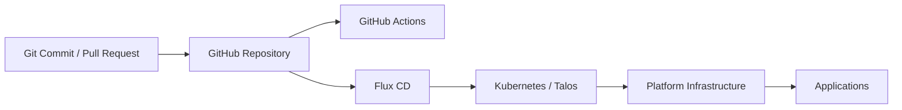

# Homelab

A personal homelab built to learn, experiment with, and operate modern infrastructure using **Kubernetes, GitOps, and infrastructure-as-code practices**.

This repository contains the public, sanitized configuration for services running in my home environment. It is also a learning project where I can explore platform engineering, DevOps, Kubernetes operations, automation, observability, security, and reliability practices in a real environment.

> **Status:** Early stage and actively evolving.
> The goal is not to reproduce an enterprise platform at home, but to understand the technologies, operational patterns, and trade-offs behind one.

---

## Goals

This project has two main purposes:

1. Run useful services in my home environment.
2. Develop practical experience with technologies and patterns used in DevOps, SRE, Cloud, and Platform Engineering roles.

Some of the principles I am trying to follow are:

* Git as the source of truth
* Declarative infrastructure and application configuration
* GitOps-based Kubernetes reconciliation
* Reproducible deployments
* Encrypted secrets in Git
* Clear separation between platform infrastructure and applications
* Automated validation before configuration reaches the cluster
* Small, understandable changes rather than large one-time deployments
* Explicit dependency ordering
* Documenting design decisions and trade-offs as the environment grows
* Keeping public portfolio material separate from sensitive home infrastructure details

---

## Environment Scope

This repository represents the **public, sanitized portion** of my homelab.

The complete environment also includes infrastructure such as **Proxmox VE** and **TrueNAS**, but configuration for those systems is maintained separately in private repositories.

This separation is intentional.

The public repository is designed to demonstrate my approach to:

* Kubernetes administration
* GitOps with Flux CD
* infrastructure configuration
* secrets management
* application delivery
* CI validation
* platform engineering practices
* operational decision-making

without exposing information that could unnecessarily increase the attack surface of my home environment.

Sensitive or environment-specific information such as internal addressing, detailed storage topology, host configuration, credentials, recovery information, and other security-relevant infrastructure details are intentionally excluded.

Conceptually, the environment looks like:

```text
Physical Homelab
│
├── Proxmox VE
│   └── Compute / Virtualization
│
├── TrueNAS
│   └── Storage Services
│
└── Kubernetes Cluster
    ├── Talos Linux
    ├── Flux CD
    ├── Platform Infrastructure
    └── Applications
         ▲
         │
         │ GitOps reconciliation
         │
Public GitHub Repository
```

The public repository therefore focuses on demonstrating reproducible engineering practices while maintaining an appropriate security boundary around the underlying home infrastructure.

---

## Architecture

The Kubernetes environment is managed using **Flux CD**.

Changes are made in Git, validated through CI, and then continuously reconciled by Flux toward the desired state defined in this repository.



The reconciliation flow is intentionally ordered so that applications are deployed only after the infrastructure they depend on is available.

```text
Secrets
   │
   ▼
Core Infrastructure
   │
   ├── cert-manager
   ├── MetalLB
   ├── Traefik
   └── NFS provisioner
   │
   ▼
Applications
```

This dependency ordering is handled declaratively through Flux rather than through manual deployment sequencing.

---

## Technology Stack

| Area                    | Technology                      |
| ----------------------- | ------------------------------- |
| Virtualization          | Proxmox VE                      |
| Storage Platform        | TrueNAS                         |
| Kubernetes OS           | Talos Linux                     |
| Container Orchestration | Kubernetes                      |
| GitOps                  | Flux CD                         |
| Configuration           | Kustomize                       |
| Package Management      | Helm / Flux HelmRelease         |
| Secrets Management      | SOPS + age                      |
| Ingress                 | Traefik                         |
| Load Balancing          | MetalLB                         |
| TLS / Certificates      | cert-manager                    |
| Kubernetes Storage      | NFS-backed dynamic provisioning |
| CI                      | GitHub Actions                  |
| Standalone Containers   | Docker Compose                  |

Proxmox VE and TrueNAS are part of the overall environment, but their detailed configurations are intentionally kept outside this public repository.

The stack will continue to evolve as I experiment with new technologies and improve the architecture.

---

## Repository Structure

```text
.
├── .github/
│   └── workflows/          # CI and repository automation
│
├── apps/                   # Kubernetes application workloads
│
├── clusters/
│   └── homelab/            # Flux cluster reconciliation definitions
│
├── infrastructure/         # Kubernetes platform services
│   ├── cert-manager/
│   ├── metallb/
│   ├── storage/
│   └── traefik/
│
├── secrets/                # SOPS-encrypted Kubernetes secrets
│
├── talos/                  # Talos-related configuration
│
└── docker/
    └── stacks/             # Services running outside Kubernetes
```

The separation between `clusters`, `infrastructure`, and `apps` is intentional.

### `clusters/`

Defines what Flux should reconcile for a particular Kubernetes cluster.

This is where cluster-level reconciliation boundaries, ordering, and dependencies are defined.

### `infrastructure/`

Contains services required by the Kubernetes platform itself.

Examples include:

* certificate management
* ingress
* load balancing
* storage provisioning

### `apps/`

Contains end-user workloads that depend on the underlying platform infrastructure.

### `secrets/`

Contains encrypted Kubernetes secrets managed using SOPS.

### `docker/`

Contains workloads that are intentionally operated outside Kubernetes.

Not every service needs to run inside a Kubernetes cluster, and part of the project is learning when Kubernetes is useful and when a simpler deployment model is more appropriate.

---

## GitOps Workflow

The normal deployment workflow is:

```text
Make configuration change
        │
        ▼
Commit to Git
        │
        ▼
GitHub Actions validation
        │
        ▼
Merge / push to main
        │
        ▼
Flux detects repository change
        │
        ▼
Flux reconciles Kubernetes resources
        │
        ▼
Cluster converges to desired state
```

The intention is to avoid manually changing persistent Kubernetes configuration whenever possible.

Imperative commands such as `kubectl`, `helm`, or `flux` are primarily used for:

* debugging
* inspecting cluster state
* initial bootstrap operations
* validating changes
* troubleshooting failed reconciliations

Persistent desired state should live in Git.

---

## Flux CD

Flux is responsible for continuously reconciling the Kubernetes cluster with this repository.

Cluster configuration under:

```text
clusters/homelab/
```

defines separate reconciliation boundaries for infrastructure components and applications.

Dependencies are defined where appropriate so workloads are not deployed before the services they require.

This allows the deployment order to be described declaratively instead of relying on manual sequencing.

---

## Secrets Management

Sensitive Kubernetes values are managed using **SOPS** encryption with **age**.

Encrypted secrets can therefore remain version-controlled without committing plaintext credentials to the repository.

The general model is:

```text
Plaintext Secret
      │
      ▼
SOPS encryption
      │
      ▼
Encrypted YAML in Git
      │
      ▼
Flux decrypts during reconciliation
      │
      ▼
Kubernetes Secret
```

Private decryption keys are kept outside the repository.

The presence of encrypted secret manifests in Git is intentional; the sensitive values themselves remain encrypted.

---

## cert-manager

cert-manager provides certificate management inside the Kubernetes cluster.

It is used to automate TLS certificate lifecycle management for services exposed through the ingress layer.

Both staging and production certificate issuers are maintained declaratively.

Using a staging issuer makes it possible to validate configuration without unnecessarily hitting production certificate authority limits.

---

## MetalLB

MetalLB provides `LoadBalancer` functionality for the bare-metal Kubernetes environment.

This allows Kubernetes services to receive addresses that can be reached from the local network without requiring a cloud-provider load balancer.

MetalLB is managed through Flux as part of the platform infrastructure.

---

## Traefik

Traefik provides ingress routing for HTTP and HTTPS services running in the cluster.

Together with cert-manager, it forms the ingress and TLS layer for applications.

The goal is to keep ingress configuration declarative and version-controlled rather than manually configured.

---

## Storage

Persistent Kubernetes workloads currently use **NFS-backed dynamic provisioning**.

The NFS service itself is provided by infrastructure outside the scope of this public repository.

Kubernetes consumes that storage through a dynamic provisioner, allowing applications to request persistent storage using standard `PersistentVolumeClaim` resources.

Conceptually:

```text
TrueNAS / Private Storage Infrastructure
              │
              ▼
             NFS
              │
              ▼
Kubernetes NFS Provisioner
              │
              ▼
StorageClass
              │
              ▼
PersistentVolumeClaim
              │
              ▼
Application
```

This keeps application manifests focused on their storage requirements without exposing unnecessary details about the underlying storage infrastructure.

---

## Applications

The application layer is intentionally small while the underlying platform is being developed.

I prefer to add workloads gradually so that I can understand the operational behavior and dependencies of each part of the system rather than deploying a large application catalog immediately.

### Actual Budget

Actual Budget is deployed as a Kubernetes workload.

Its deployment currently demonstrates the use of:

* Kubernetes Deployment
* Service
* Ingress
* PersistentVolumeClaim
* Kustomize
* GitOps reconciliation

Additional applications will be added as the platform matures.

---

## Docker Workloads

Not every home service needs to run inside Kubernetes.

Some workloads are intentionally kept as Docker Compose stacks where Kubernetes does not currently provide enough benefit to justify the additional complexity.

For example:

```text
docker/stacks/home-assistant/
```

This is part of the design philosophy of the lab.

The goal is not to move everything into Kubernetes simply because Kubernetes is available.

The goal is to understand which deployment model best fits a workload and to be able to explain that decision.

---

## Continuous Integration

GitHub Actions is used to validate Flux-managed configuration before changes are applied.

Current validation includes building Flux Kustomizations for infrastructure components such as:

* cert-manager
* MetalLB
* Traefik
* NFS storage

The CI pipeline will expand as the repository grows.

Areas I plan to explore include:

* Kubernetes schema validation
* YAML linting
* security scanning
* policy validation
* application manifest validation
* dependency update automation
* container image scanning
* GitOps policy checks

The goal of CI in this repository is not only to catch syntax errors, but eventually to provide confidence that a Git change is safe to reconcile.

---

## Design Philosophy

This repository is deliberately being built incrementally.

Instead of deploying a large collection of tools immediately, I am trying to understand each part of the platform before introducing additional complexity.

The environment has been built progressively around concepts such as:

```text
Kubernetes
    ↓
GitOps
    ↓
Secrets Management
    ↓
Certificate Management
    ↓
Load Balancing
    ↓
Ingress
    ↓
Persistent Storage
    ↓
Applications
    ↓
Observability
    ↓
Reliability and Recovery
```

Each layer introduces new operational concerns and dependencies that I want to understand before moving further up the stack.

The objective is not simply to make services run.

The objective is to understand:

* why the system works
* how the components depend on each other
* how changes are delivered safely
* how failures can be diagnosed
* how services recover
* how infrastructure can be rebuilt
* what trade-offs were made
* where complexity is justified
* where simpler solutions are better

---

## Public vs Private Infrastructure

Not every part of a real environment belongs in a public GitHub repository.

I intentionally separate the homelab into public and private configuration boundaries.

```text
Private Repositories
│
├── Proxmox VE configuration
├── TrueNAS / storage configuration
├── environment-specific infrastructure details
├── internal addressing
└── sensitive operational information

Public Repository
│
├── Kubernetes platform configuration
├── Flux reconciliation
├── application manifests
├── encrypted secrets
├── CI validation
└── architecture and engineering decisions
```

The public repository exists to demonstrate engineering skills without publishing unnecessary information about a live home network.

This trade-off is intentional: transparency is useful for learning and portfolio purposes, but security boundaries should still be respected.

---

## What I Am Learning

This project is a practical environment for developing deeper understanding of:

* Kubernetes architecture
* GitOps workflows
* Flux reconciliation
* Kustomize
* Helm-based deployments
* secrets management
* TLS and certificate lifecycle management
* ingress architecture
* load balancing
* persistent storage
* container networking
* CI/CD
* infrastructure troubleshooting
* application lifecycle management
* observability
* backup and recovery
* security hardening
* infrastructure design trade-offs

As the lab grows, I expect some design decisions to change.

Those changes are part of the project rather than something I intend to hide.

Being able to identify weaknesses in an existing design, understand why they exist, and improve them is one of the main reasons I maintain this environment.

---

## Roadmap

This project is still in its early stages.

Current areas I plan to explore include:

* [ ] Improve CI validation
* [ ] Add automated dependency updates
* [ ] Deploy Prometheus
* [ ] Deploy Grafana
* [ ] Build useful infrastructure dashboards
* [ ] Add alerting
* [ ] Add centralized logging
* [ ] Add application and infrastructure health monitoring
* [ ] Define Kubernetes resource requests and limits
* [ ] Explore NetworkPolicies
* [ ] Improve security validation
* [ ] Add backup automation
* [ ] Test restore procedures
* [ ] Document disaster recovery
* [ ] Document cluster bootstrap and rebuild procedures
* [ ] Add Flux notifications
* [ ] Improve application health checks
* [ ] Explore policy-as-code
* [ ] Improve storage resilience
* [ ] Add additional self-hosted applications
* [ ] Document architecture decisions and trade-offs
* [ ] Test failure and recovery scenarios

The roadmap is intentionally flexible.

I would rather add capabilities when I have a reason to understand and operate them than install tools only to increase the size of the technology list.

---

## Why a Homelab?

Documentation, courses, and tutorials are useful, but operating real services introduces problems that are difficult to reproduce in isolated exercises.

For example:

* certificates expire
* applications fail
* storage becomes unavailable
* DNS breaks
* dependencies fail
* configuration changes have unintended consequences
* upgrades introduce incompatibilities
* networking problems require debugging
* persistent data needs protection
* monitoring needs useful signals
* alerts need to be actionable
* backups eventually need to be restored

A homelab provides an environment where I can encounter these problems, investigate them, and improve the system iteratively.

This repository therefore represents both the current state of the infrastructure and the ongoing learning process behind it.

---

## Security Considerations

Because this repository is public and some of the workloads represented here are connected to a real home environment, I intentionally avoid publishing unnecessary infrastructure details.

Some examples of information that may be generalized, omitted, encrypted, or stored privately include:

* credentials
* private keys
* internal IP addressing
* detailed network topology
* sensitive host configuration
* storage internals
* recovery credentials
* hardware-specific security information
* environment-specific secrets

The goal is to demonstrate reproducible infrastructure practices without treating public exposure as a requirement for every implementation detail.

Security decisions are part of the architecture of this project, not an afterthought.

---

## Disclaimer

This is a personal learning environment running on home infrastructure.

Patterns used here are influenced by production practices, but decisions are also made according to the scale, hardware, risk profile, operational requirements, and constraints of a homelab.

This repository should therefore not be interpreted as a production reference architecture.

Where possible, I prefer to document the reasoning and trade-offs behind decisions rather than present the environment as something it is not.

---

## Project Status

This project is actively maintained and intentionally incomplete.

The current focus is on building a stable Kubernetes and GitOps foundation before expanding further into observability, reliability, security, automation, and additional workloads.

The repository will continue to evolve as I learn, operate, break, troubleshoot, and improve the environment.
